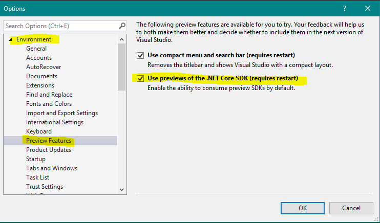

# AsyncEnumerableInterface
 Trying out the new `IAsyncEnumerable<T>` inteface

#### Links
 * [Tutorial](https://dev.to/dotnet/what-s-the-big-deal-with-iasyncenumerable-t-in-net-core-3-1eii)
 * [.Net Core 3](https://dotnet.microsoft.com/download/dotnet-core/3.0) - Preview Download
   * 
 * [.Net Core 3](https://docs.microsoft.com/en-us/dotnet/core/whats-new/dotnet-core-3-0?WT.mc_id=devto-blog-antchu) - New Features
 * [IAsyncEnumerable](https://docs.microsoft.com/en-us/dotnet/api/system.collections.generic.iasyncenumerable-1?view=netstandard-2.1)

## ON HOLD:
<pre>
This will not work with Net Core 3.0 along with EntityframeworkCore, because of the following error: 
Error	CS0433	The type 'IAsyncEnumerable<T>' exists in both 'System.Interactive.Async, Version=3.2.0.0, Culture=neutral, PublicKeyToken=94bc3704cddfc263' 
and 'System.Runtime, Version=4.2.1.0, Culture=neutral, PublicKeyToken=b03f5f7f11d50a3a'
</pre>